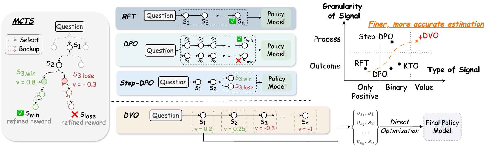

<div align="center">

<h1>Direct Value Optimization:

Improving Chain-of-Thought Reasoning in LLMs with Refined Values</h1>

<p align="center">
  <a href="https://arxiv.org/abs/2502.13723"> 📝 Paper</a> •
  <a href=""> 🛠️ Project</a>
</p>
</div>


# 🎉 News
* **[2025.2.21]** The code is released!
* **[2025.2.20]** The paper is relesed on arxiv! [\[link\]](https://arxiv.org/abs/2502.13723)


# 💡 Introduction  <a name="IntroductionTitle"></a>
**Direct Value Optimization (DVO)** is a novel reinforcement learning framework that enhances language models' reasoning capabilities through step-level value signals rather than preference labels. Using Monte Carlo Tree Search or value models to estimate target values, DVO achieves superior performance in mathematical and commonsense reasoning tasks while requiring less training data compared to traditional preference optimization methods.



# 🚀 Usage <a name="usage"></a>
<span id="#usage"></span>
## Project Structure
```
DVO/
├── configs/
│   ├── accelerate_configs/
│   └── deepseekmath-instruct/	# Parameters for LM_server/Search/Training.
├── eval/                     	# Code for Evaluation
├── figures/
├── lm_server/                	# Code for Inference Engine (Vllm/Sglang).
├── mcts_math/
├── search_sampling/          	# Code for Data Construction Pipeline
├── training/                 	# Code for Training on data from MCTS.
├── scripts/                  	# Shell scripts for pipeline execution.
└── README.md
```

## Data Construction and Training Pipeline
### Step 0: Start the server
```
bash scripts/step_0_server_on.sh
```
* Two things to modified:
    * The default inference engine is set to "sglang"(`$SERVER_TYPE`).
    * Specify the path of the model config file (`$CONFIG_FILE`).
        * The path of the models(policy/ref model) and the ports are set in the config.

### Step 1: MCTS
```
bash scripts/step_1_mcts.sh <config_file> <data_file> <total_bucket>
```
**Parameters:**
- `config_file`: Path to the model configuration file
- `data_file`: Path to the input data file
- `total_bucket`: Number of threads for data parallelism

### Step 2: Sample trajectories
```
bash scripts/step_2_sample_output.sh <config_file>
```
**Parameters:**
- `config_file`: Path to the model configuration file

### Step 3: Data Building
```
bash scripts/step_3_build_data.sh <data_path> [threshold] [max_choosing_num] [system_prompt]
```
**Parameters:**
- `data_path`: Output path from Step 2
- `threshold`: (Optional)
- `max_choosing_num`: (Optional)
- `system_prompt`: (Optional)

### Step 4: Training
```
bash scripts/step_4_training.sh <config_file> [mode]
```
**Parameters:**
- `config_file`: Path to the model configuration file.
- `mode`: (Optional) Zero level.

## 🧮 Evaluation
```
bash evaluation.sh <model_path> <template_path>
```
**Parameters:**
- `model_path`: Path to the trained model
- `template_path`: Path to the evaluation template file

**Note:** No need to manually start LM_server.

# 🌸 Acknowledgement
* For the training pipeline, we used the [alignment-handbook](https://github.com/huggingface/alignment-handbook) from Huggingface.
* For the MCTS part, we inherited part of the code from the project [Super_MARIO](https://github.com/MARIO-Math-Reasoning/Super_MARIO) (Code for paper: [AlphaMath Almost Zero: Process Supervision without Process](https://arxiv.org/abs/2405.03553)). Thanks to their great work and contributions!


# 📝 Citation
```bib
@misc{zhang2025directvalueoptimizationimproving,
      title={Direct Value Optimization: Improving Chain-of-Thought Reasoning in LLMs with Refined Values},
      author={Hongbo Zhang and Han Cui and Guangsheng Bao and Linyi Yang and Jun Wang and Yue Zhang},
      year={2025},
      eprint={2502.13723},
      archivePrefix={arXiv},
      primaryClass={cs.CL},
      url={https://arxiv.org/abs/2502.13723},
}
```
We are from WestlakeNLP, the School of Engineering, the Westlake University.